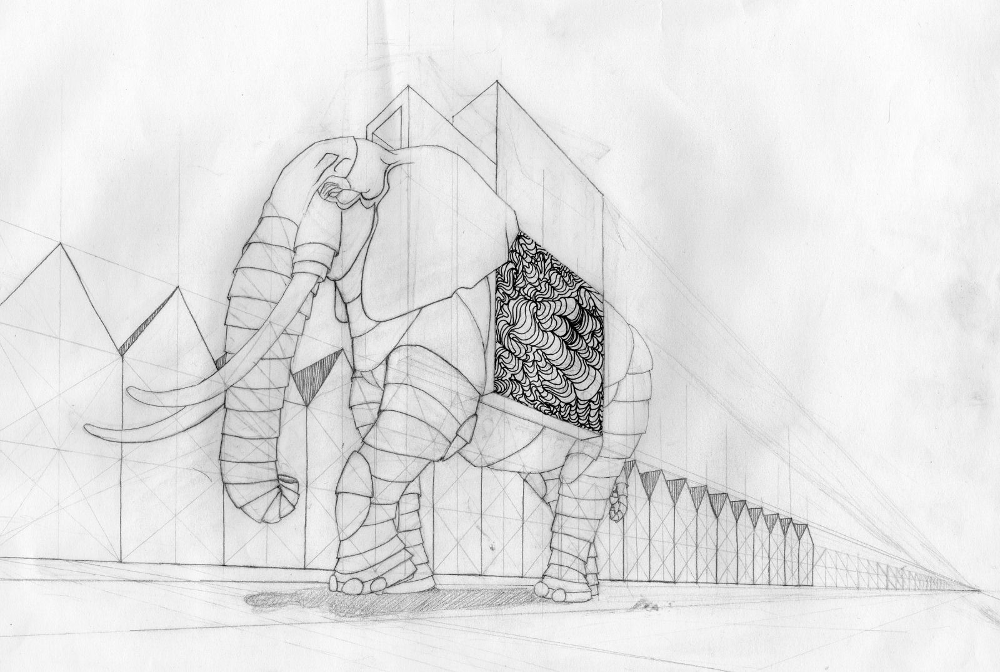
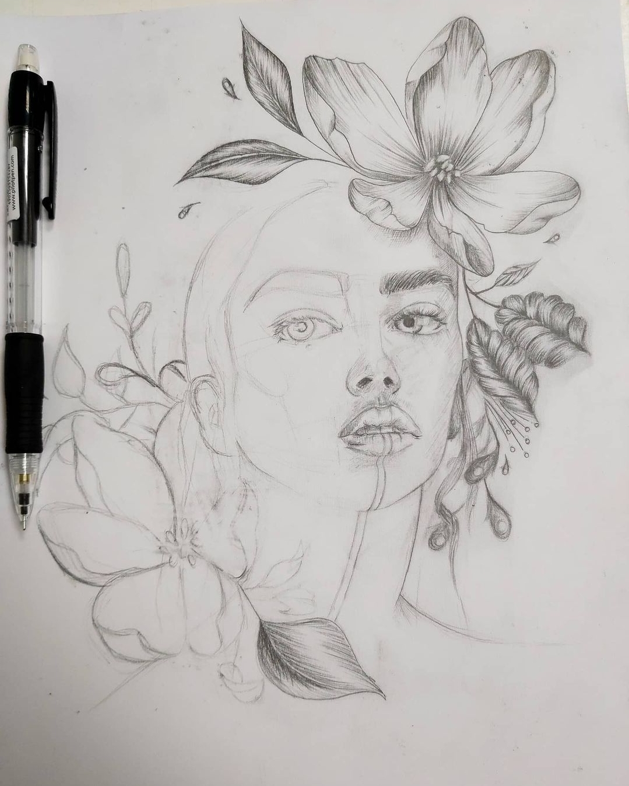
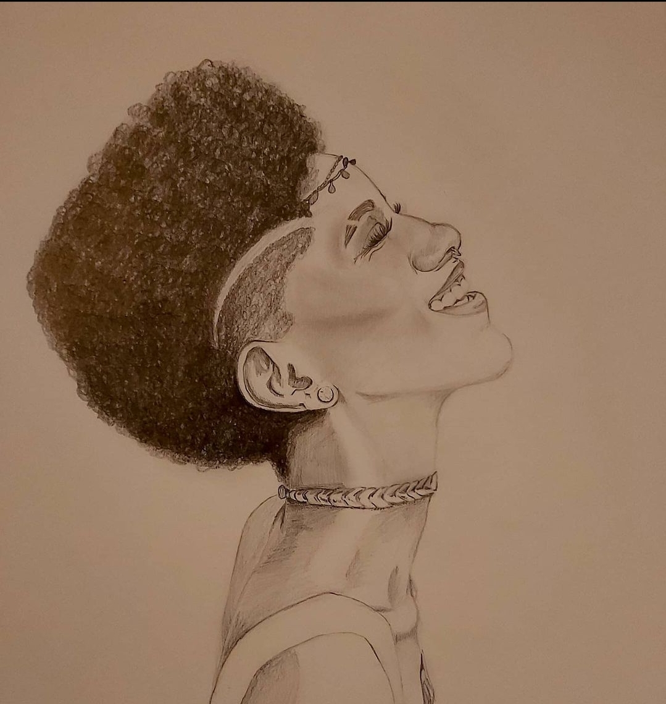
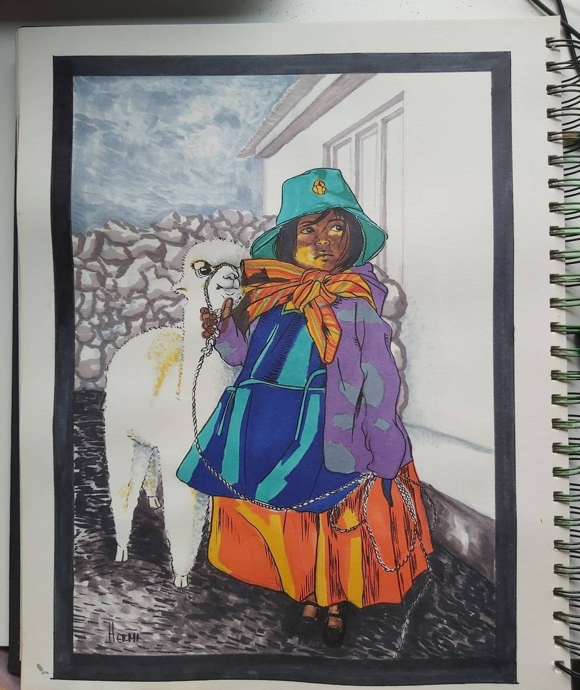

# 🎨 Art Work – Traditional & Digital Collection  

<p align="center">
  
  
  
  
</p>

<p align="center">
  
  <br>
  <em>Architectural Sketch – Elephant Structure</em>
</p>

A curated collection of my **traditional and digital artworks**, showcasing different mediums, techniques, and creative processes.  
This portfolio highlights studies in **anatomy, composition, light, and emotion**, combining analog textures with digital refinement.

> *Exploring emotion, line, and light through traditional and digital forms. ✏️💻*

## 🖼️ Featured Works  

### ✏️ Traditional Drawings  
<div align="center">

<table>
  <tr>
    <td align="center"><strong>Floral Composition</strong><br></td>
  </tr>
    <tr>
    <td align="center"><strong>Hand Detail Study</strong><br></td>
  </tr>
    <tr>
    <td align="center"><strong>Portrait Study – Pencil & Tone</strong><br></td>
  </tr>
   <tr>
    <td align="center"><strong>Emotive Portrait – Afro Series</strong><br></td>
  </tr>
</table>

</div>

<br>

### 🖋️ Mixed Media & Color  
<div align="center">

<table>
  <tr>
    <td align="center"><strong>Alcohol Marker Illustration – Peruvian Woman</strong><br></td>
  </tr>  
  <tr>
    <td align="center"><strong>Watercolor Portrait – Great Dane</strong><br></td>
  </tr>
    <tr>
    <td align="center"><strong>Architectural Sketch – Elephant Structure</strong><br></td>
  </tr>
</table>

</div>

<br>

### 💻 Digital Art  
<div align="center">

<table>
  <tr>
    <td align="center"><strong>Digital Portrait – Photoshop Painting</strong><br></td>
  </tr>
  <tr>
    <td align="center"><strong>Color exploration</strong><br></td>
  </tr>
</table>

</div>
<br>

## 🗂️ Project Structure  

```bash
Art-Work/
├── preview-digital-art/              # Digital paintings & Photoshop studies
│   ├── 1-portrait-photoshop.jpg
│   ├── photoshop-illustration.jpg
│   ├── oleo_photoshop_paint.jpg
│   ├── COLOR PERSONAJE.png
│   └── isometricalimpio.png
│
├── preview-traditional-art/          # Traditional drawings and mixed media
│   ├── pencil_scketch.jpg
│   ├── portrait_scketch_afro.jpg
│   ├── alcohol_marker_work.jpg
│   ├── full_watercolor_dog_portrait.jpg
│   ├── elephant.jpg
│   └── vehículo_scketch.png
│
└── README.md                         # Project documentation (this file)
```

## 🧠 Concept & Vision

This collection reflects years of experimentation across **different media**, moving between paper, pigment, and pixels.
Each piece represents a moment of study — exploring **light, expression, and material** in its purest form.

- ✏️ Graphite: anatomy, gesture, and emotion studies

- 🖋️ Mixed media: perspective and visual storytelling

- 💧 Watercolor & markers: light diffusion and tone exploration

- 💻 Digital: composition, lighting, and stylization

> *A fusion between the tactile imperfections of traditional art and the precision of digital creation.*

## 👩‍🎨 Author

**Génesis Vaca Palma**

*Traditional & Digital Artist · Web Developer in progress*

<br>
